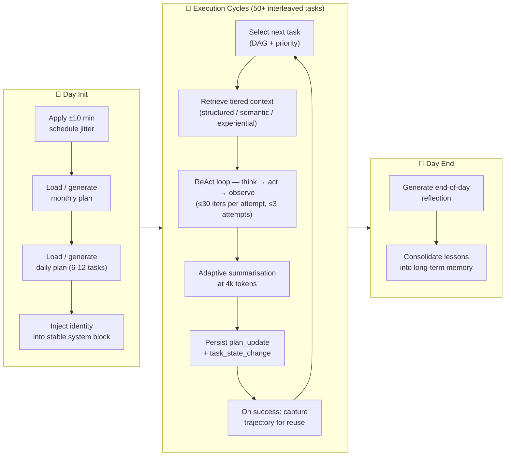
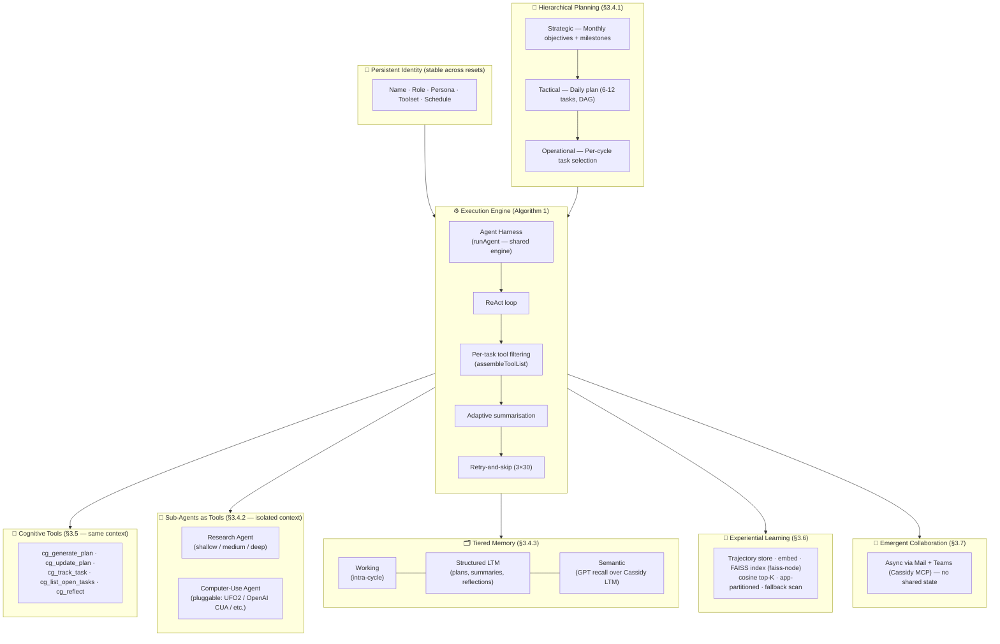

# CorpGen for Cassidy

An autonomous **digital employee** runtime layered on top of Cassidy. Implements the
four core mechanisms from
[**CorpGen: Simulating Corporate Environments with Autonomous Digital Employees in
Multi-Horizon Task Environments**](https://arxiv.org/abs/2602.14229)
(Jaye et al., Microsoft Research, Feb 2026):

1. **Hierarchical Planning** (§3.4.1) — Strategic (monthly) → Tactical (daily) → Operational (per-cycle)
2. **Sub-Agents as Tools** (§3.4.2) — research + computer-use, isolated context scopes
3. **Tiered Memory** (§3.4.3) — Working / Structured LTM / Semantic
4. **Adaptive Summarisation** (§3.4.4) — critical vs routine, 4 k-token threshold

Plus the supporting capabilities:

- **Cognitive tools** (§3.5) — `cg_generate_plan`, `cg_update_plan`, `cg_track_task`, `cg_list_open_tasks`, `cg_reflect`
- **Experiential learning** (§3.6) — capture successful trajectories, app-aware top-K retrieval (FAISS vector index with cosine similarity, fallback to in-memory scan + Jaccard)
- **Reusable agentic harness** — declarative `AgentDefinition` objects executed by a single `runAgent()` engine, with context isolation, lifecycle hooks, budget tracking, and per-task tool filtering
- **Per-task tool filtering** — `assembleToolList()` sorts tools by app relevance (cognitive/subagent first, app-matching MCP tools next, others fill 128-tool cap)
- **Persistent identity & realistic schedule** (§3.4.4) — 8–18 h with ±10 min jitter, 5-min minimum cycle interval
- **Retry-and-skip policy** (§3.4.4) — 3 attempts × 30 ReAct iterations, then skip to keep the day moving
- **Emergent collaboration** (§3.7) — none required at this layer; Cassidy already coordinates via Mail + Teams MCP servers, which is exactly the paper's "no shared internal state" model

## Files

| File | Purpose |
| --- | --- |
| [types.ts](types.ts) | Shared types — identity, plans, memory records, ReAct turn, run result |
| [identity.ts](identity.ts) | Persistent identity (Azure Table) + ±10 min schedule jitter |
| [hierarchicalPlanner.ts](hierarchicalPlanner.ts) | Monthly + daily plan generation, DAG-aware task selection |
| [tieredMemory.ts](tieredMemory.ts) | Working / Structured LTM / Semantic recall + cycle-start retrieval |
| [adaptiveSummarizer.ts](adaptiveSummarizer.ts) | Critical/routine classifier + 4 k-token compression |
| [cognitiveTools.ts](cognitiveTools.ts) | Forced-structure planning / tracking / reflection tools |
| [subAgents.ts](subAgents.ts) | Research agent + pluggable Computer-Use sub-agent (isolated context) |
| [experientialLearning.ts](experientialLearning.ts) | Trajectory capture + top-K retrieval (FAISS primary, cosine fallback) |
| [agentHarness.ts](agentHarness.ts) | Reusable agentic execution engine — `runAgent()` + `assembleToolList()` |
| [faissIndex.ts](faissIndex.ts) | FAISS vector index — lazy load, 10-min cache TTL, fallback cosine scan |
| [digitalEmployee.ts](digitalEmployee.ts) | **Algorithm 1** — Day Init → Execution Cycles → Day End |
| [index.ts](index.ts) | Public barrel |

## Figure 1 — A Digital Employee's Workday



## Figure 2 — CorpGen Architecture



## Wiring it into Cassidy

The runner is **infrastructure-agnostic**. You provide a `ToolExecutor` adapter that
exposes whatever live MCP / native tools you want the digital employee to use:

```ts
import { runWorkday, type ToolExecutor } from './corpgen';
import { getAllTools, executeTool } from './tools/index';
import { getLiveMcpToolDefinitions } from './tools/mcpToolSetup';

const executor: ToolExecutor = {
  hostTools: () => [...getAllTools(), ...getLiveMcpToolDefinitions()],
  execute: (name, args) => executeTool(name, args),
};

// Run one workday for the default Cassidy identity
const result = await runWorkday({ executor });
console.log(result);
// {
//   employeeId: 'cassidy', date: '2026-04-20',
//   cyclesRun: 11, tasksCompleted: 7, tasksSkipped: 1, tasksFailed: 0,
//   reflection: '...'
// }
```

To trigger a workday on a schedule, call `runWorkday()` from the existing
[`scheduler/`](../scheduler/) module or the
[`azure-function-trigger/`](../../azure-function-trigger/) Logic App
(it's already designed for daily kickoffs).

## Swapping the Computer-Use sub-agent

The default CUA returns a structured intent plan only (no GUI automation),
because Cassidy's MCP servers already cover Office actions. To plug a real
CUA (UFO2, OpenAI computer-use-preview, etc.):

```ts
import { registerCuaProvider } from './corpgen';

registerCuaProvider(async (req) => {
  // call your CUA backend, return { ok, app, intent, steps[], result, durationMs }
});
```

This matches the paper's modular design (§3.4.2) — swap the CUA without touching
the host architecture.

## Agentic Harness

All three agent types (CorpGen main loop, Research, CUA planner) execute through
a single `runAgent()` function in `agentHarness.ts`. Agents are **declarative
definitions**, not classes:

```ts
import { runAgent, type AgentDefinition } from './corpgen';

const MY_AGENT: AgentDefinition = {
  agentId: 'my-custom-agent',
  systemPrompt: 'You are a helpful assistant.',
  maxIterations: 10,
  toolChoice: 'auto',
};

const outcome = await runAgent({
  agent: MY_AGENT,
  userMessages: [{ role: 'user', content: 'Do the thing.' }],
  tools: allTools,
  appHint: 'Mail',  // optional — enables per-task tool filtering
  dispatchTool: (name, args) => executor.execute(name, args),
  budget: { startMs: Date.now(), maxWallclockMs: 300_000, maxToolCalls: 200, toolCallsUsed: 0 },
  hooks: {
    onToolCall: (name, args) => console.log(`calling ${name}`),
    onToolResult: (name, result, error, durationMs) => console.log(`${name} → ${durationMs}ms`),
  },
});
```

### Per-task tool filtering

When `appHint` is set, `assembleToolList()` sorts the tool array:

1. **Cognitive + sub-agent tools** — always promoted (they're load-bearing for the ReAct loop)
2. **App-relevant MCP tools** — matched by server prefix (e.g. `mcp_MailTools_*` for `appHint='Mail'`)
3. **App-relevant static tools** — matched by name (e.g. `sendEmail` for Mail)
4. **Remaining tools** — fill up to the 128-tool cap

This reduces tool-selection noise by ~60-80% for focused tasks.

## FAISS Vector Index

Experiential trajectory retrieval uses FAISS (`faiss-node`, optional dependency) for
fast cosine-similarity search. One index per app, lazy-loaded from Table Storage:

```ts
import { getAppIndex, rebuildAppIndex, clearAllIndices } from './corpgen';

const index = await getAppIndex('Mail');
const hits = await index.search(queryEmbedding, 3);
// [{ demoId: '01HXYZ...', score: 0.92 }, ...]
```

If `faiss-node` is not installed (native build failure on some platforms), the module
falls back to the same in-memory cosine scan as before — no functionality lost.

## Ablation alignment with the paper

Per Table 2 in the paper, experiential learning provides the largest single gain.
This implementation includes it from day one. To run the same incremental
ablation, you can disable individual mechanisms:

| Component | How to disable |
| --- | --- |
| Cognitive tools | Filter out `cg_*` from the tool list in your `ToolExecutor` |
| Sub-agents | Filter out `cg_research`, `cg_computer_use` |
| Tiered retrieval | Pass `config: { structuredTopK: 0, semanticTopK: 0 }` to `retrieveForCycle` |
| Experiential learning | Skip `captureSuccessfulTrajectory` calls |
| FAISS index | Uninstall `faiss-node` — falls back to in-memory cosine scan automatically |
| Per-task tool filtering | Omit the `appHint` parameter when calling `runAgent()` |

## Storage tables created on first use

- `CorpGenIdentities`
- `CorpGenMonthlyPlans`
- `CorpGenDailyPlans`
- `CorpGenStructuredMemory`
- `CorpGenTrajectories` (also used by FAISS index — lazy-loaded into `IndexFlatIP` per app partition)

All managed by Cassidy's existing `memory/tableStorage.ts` (auto-create with
graceful fallback on `AuthorizationFailure`).
